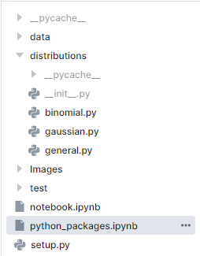

# Creating Python Package using Jupyter Notebook
 Creating your first data science python package straight from Jupyter Notebook.


> **Creating your first data science python package straight from Jupyter Notebook.**

[](https://deepnote.com/viewer/github/kingabzpro/Creating-Python-Package-using-Jupyter-Notebook/blob/main/python_packages.ipynb)

Have you wondered how Python packages like Scikit-learn, pandas, and NumPy are built? They are all based on Object Orient Programming (OOP) to create complex and easy-to-use packages. For a data scientist it's a necessity to learn OOP so they can use it in development of production ready products.

We are going to use the cloud Jupyter Notebook to ease the setting up of the environment and completely focus on creating a package. The project includes fundamentals of OOP like Inheritance, objects, class, and magic functions. The project is highly influenced by AWS Machine Learning Foundations course, and it took me ten minutes to recreate the package once I knew how to build it.

# Creating ***__init__.py*** Function

We need to create __init__.py file in the distributions folder to initialize the classes within the python file. This will help us call specific classes directly.

We have initiated both Binomial and Gaussian class.

```python
%%writefile distributions/__init__.py

from .binomial import Binomial

from .gaussian import Gaussian
```

```
Writing distributions/__init__.py 
```

# Creating *setup.py* Function

setup.py function giving all necessary information about the package. It uses setuptools library to create package name, version, description, author name, etc. We have to create this file outside the distribution folder.

```python
%%writefile setup.py

from setuptools import setup

setup(name='distributions',

   version='0.2',

   description='Gaussian and Binomial distributions',

   packages=['distributions'],

   author = "Abid Ali Awan",

   author_email = "abidaliawan@rocketmail.com",

   zip_safe=False)

```
```
Writing setup.py 
```

# Directory

The image below shows the package directory contain all required files.



# Installing distributions Package

Using `pip install .` or `pip install -U .` to install the python package which we can use in any project. As we can see our distribution package is successfully installed.

```
(venv) root@deepnote:~/work # pip install -U .
Processing /work
Building wheels for collected packages: distributions
  Building wheel for distributions (setup.py) ... done
  Created wheel for distributions: filename=distributions-0.2-py3-none-any.whl size=4800 sha256=39bc76cbf407b2870caea42b684b05efc15641c0583f195f36a315b3bc4476da
  Stored in directory: /tmp/pip-ephem-wheel-cache-ef8q6wh9/wheels/95/55/fb/4ee852231f420991169c6c5d3eb5b02c36aea6b6f444965b4b
Successfully built distributions
Installing collected packages: distributions
  Attempting uninstall: distributions
    Found existing installation: distributions 0.2
    Uninstalling distributions-0.2:
      Successfully uninstalled distributions-0.2
Successfully installed distributions-0.2
```

# Testing our Package

We will be running Python kernel within Linius terminal and then test  both classes. Well done you have created your first python package.

```
>>> from distributions import Gaussian
>>> from distributions import Binomial
>>> 
>>> print(Gaussian(20,6))
mean 20, standard deviation 6
>>> print(Binomial(0.4,50))
mean 20.0, standard deviation 3.4641016151377544, p 0.4, n 50
>>> 
```
